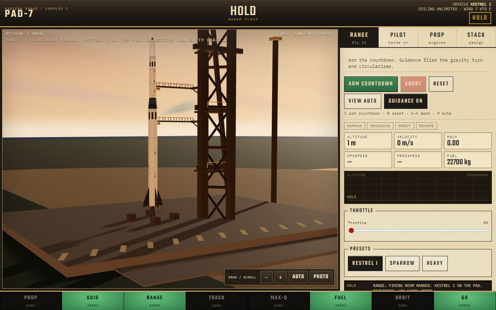
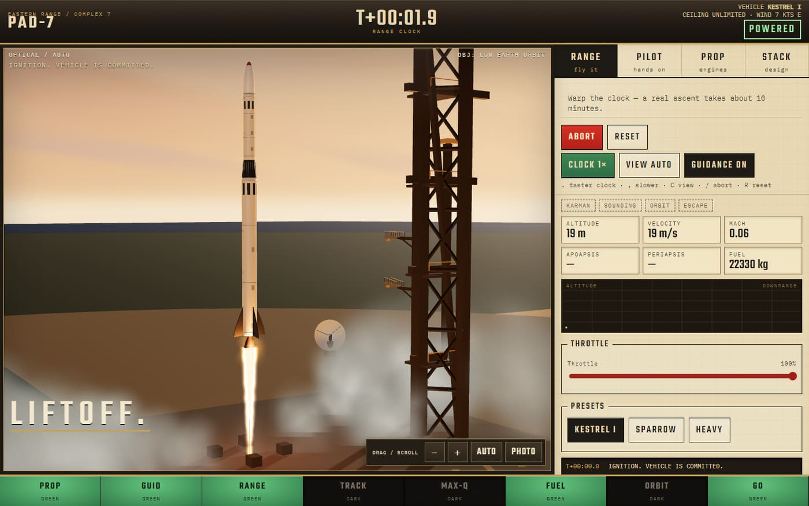

# PAD-7 Firing Room

A dawn blockhouse on the Eastern Range. Arm a ten-second count, light Kestrel I, and warp the clock until the orbit lamp goes green.

No install. Double-click [`PAD-7.html`](PAD-7.html). Same room on the web: [travisjohnjones.com/pad-7](https://travisjohnjones.com/pad-7/PAD-7.html).



The clock stays **HOLD** until you arm it. Apoapsis and periapsis stay blank until they mean something. Eight lamps are the whole status board. **TRACK** is the radar lamp, not a camera.



A real ascent takes about ten minutes. **CLOCK** is there so you do not have to sit through it.

## Thirty seconds

1. Open `PAD-7.html`, or `Open PAD-7.bat` on Windows.
2. Click **ARM COUNTDOWN**. The browser starts audio on that click.
3. After liftoff, hit **CLOCK** until it reads 25×.
4. Wait for **ORBIT**.

RANGE flies the gravity turn and circularizes. **PILOT** is the stick.

## The room

| Surface | What it does |
|---|---|
| Optical window | Three.js. Drag to look around, scroll to zoom. **PHOTO** pauses the flight and saves a PNG, up to 4K, scene only. |
| Desk | **RANGE** flies it. **PILOT** is hands on. **PROP** is the engine card. **STACK** changes the vehicle. |
| Mosaic | PROP, GUID, RANGE, TRACK, MAX-Q, FUEL, ORBIT, GO. |
| Range clock | HOLD, then T-minus, then T-plus. |

**VIEW** cycles AUTO, PAD, TOWER, SITE, CHASE, LIMB, MAP. AUTO follows the rocket, then opens the map when orbit is in. Double-click the window to go back to AUTO.

On a touch screen, one finger orbits and two fingers zoom. Arrow keys orbit once the window is focused. Manual aim stays on the rocket at 25×. On MAP, the same gestures orbit Earth.

## Vehicles

- **Kestrel I.** Two-stage LEO. Slender booster, upper stage stays with you. RANGE puts it near 120 by 310 km.
- **Sparrow.** Sounding rocket. It wants KARMAN, then APOGEE, then splashdown.
- **Heavy.** Five bells on the core, then a vacuum stage.

Fictional stacks, with presentation dimensions, not replicas of anybody's rocket. Fins meet the hull. Bells are open. At staging, the booster you were looking at is the one that falls off. CLOCK 1× near separation, or pause with PHOTO, if you want to watch it.

## Keys

| Key | Action |
|---|---|
| I / Space | Arm, commit, or (in flight) CLOCK |
| . / , | Faster / slower clock |
| C | VIEW |
| P / Escape | Photo / resume |
| + / - | Zoom |
| Arrows | Orbit the camera, once the window is focused |
| / | Abort, or hold the count |
| R | Back to the pad |
| G | Guidance |
| W S A D X | Throttle, pitch, stage, on PILOT |
| 1–4 | Desk |
| M | Mute |

## Under the floor

```
PAD-7.html    desk, countdown, radio
desk.js       clock, lamps, scope
physics.js    gravity, drag, rocket equation, RANGE autopilot
optical.js    the window, and only the window
audio.js      Web Audio graph
three.min.js  vendored r160
```

Earth is a local NASA map. Credit is in [assets/README.md](assets/README.md). Decisions that are expensive to undo are in [docs/adr/](docs/adr/README.md).

```
node test/run.js
```

Physics, the audio desk, the paper desk, and the optical window. 69 tests. A physics change starts with a failing test.

Chrome can fly the real `file://` page. Playwright is only for that check, and playing the room still needs nothing installed.

```powershell
npm install --no-save --package-lock=false playwright
node test/browser-smoke.cjs
node test/browser-optics.cjs
node test/browser-models.cjs
```

Smoke flies through Max-Q to orbit and checks the phone-width controls. Optics covers the camera and photo save. Models checks the three vehicles, including a real staging. Shots land in `artifacts/`, which git ignores.

## What stays

- Formica, brass, mosaic. Not a glass cockpit.
- `file://` first. No bundler to play.
- 3D stays in the window.

## License

Code is MIT. See [LICENSE](LICENSE). NASA imagery is separate. See [assets/README.md](assets/README.md).
